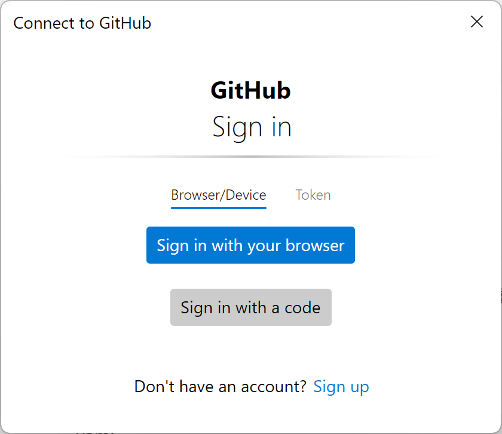
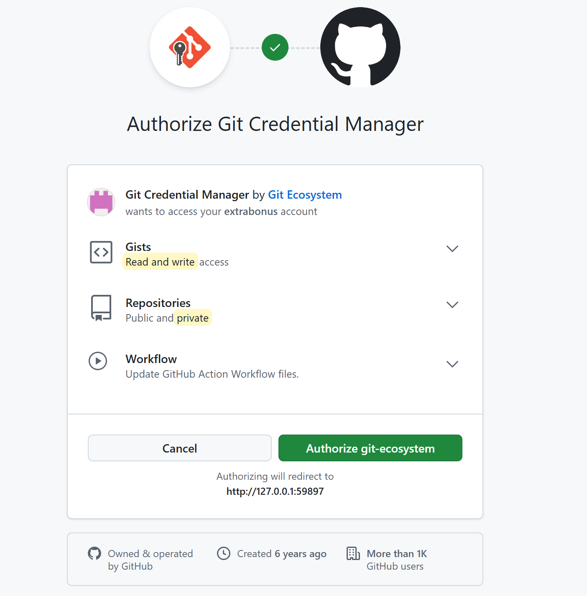
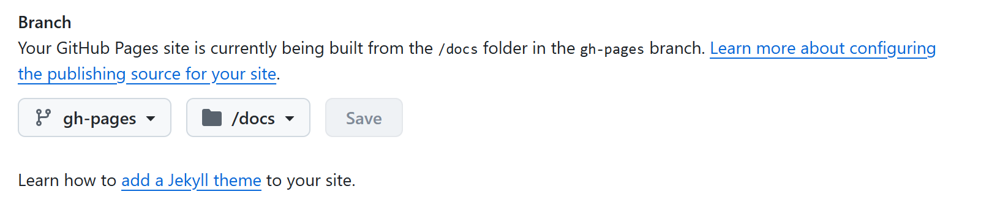
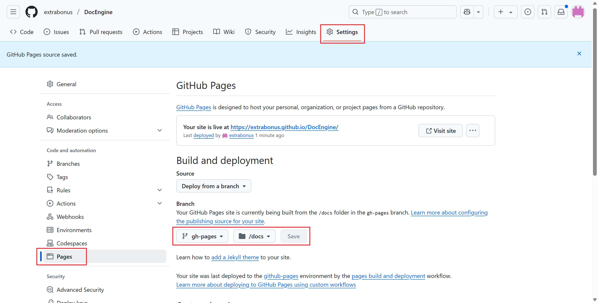

# Github pages

## 基础准备

1. 确保你的项目有静态网站入口（如 `index.html`），Vitepress默认有`index.html`文件，需进入构建好的静态文件目录：`cd docs/.vitepress/dist`。
2. 如果项目是纯代码，需要先构建生成 `dist` 或 `docs` 目录的静态文件。


## 配置流程

### 配置SSH密钥
配置 SSH 密钥可以让你安全地连接到 GitHub（无需每次输入密码），以下是详细步骤：


1. 检查现有 SSH 密钥

打开终端（Windows 用 Git Bash 或 PowerShell），运行：
```powershell
ls -al ~/.ssh
```
- 如果看到 `id_rsa.pub` 或 `id_ed25519.pub` 文件，说明已有密钥，可跳过生成步骤。
- 如果没有，继续下一步。

2. 生成新的 SSH 密钥
```powershell
ssh-keygen -t ed25519 -C "your_email@example.com"
```
- `-t ed25519`：指定密钥类型（推荐）。
- `-C "邮箱"`：替换为你的 GitHub 注册邮箱（仅作为注释，不影响功能）。

::: tip 提示
- 提示 `Enter file in which to save the key` 时，直接按回车（默认保存到 `~/.ssh/id_ed25519`）。
- 提示 `Enter passphrase` 时，可设置密码保护密钥（可选，按回车跳过）。
::: 

1. 将 SSH 密钥添加到 ssh-agent**
```bash
# 启动 ssh-agent
eval "$(ssh-agent -s)"

# 添加私钥到 ssh-agent
ssh-add ~/.ssh/id_ed25519
```
::: tip 提示
以上需在git环境下运行，推荐`Git Bash`。
:::

```powershell
# 添加密钥（替换为你的私钥路径）
ssh-add $env:USERPROFILE\.ssh\id_ed25519
```
4. 验证SSH连接

```powershell
ssh -T git@github.com
```
- 看到 `You've successfully authenticated` 表示成功。
- 如果提示 `Permission denied`，检查公钥是否粘贴完整。

### 将公钥添加到 GitHub

1. **复制公钥内容**  
   ```powershell
   cat ~/.ssh/id_ed25519.pub
   ```
   - 输出以 `ssh-ed25519 AAA...` 开头的内容，全选复制。

2. **登录 GitHub 添加密钥**  
   - 进入 **[GitHub → Settings → SSH and GPG keys](https://github.com/settings/keys)**。
   - 点击 **New SSH key**，填写：
     - **Title**：自定义名称（如 `My PC`）。
     - **Key type**：保持默认 `Authentication Key`。
     - **Key**：粘贴复制的公钥内容。
   - 点击 **Add SSH key** 完成。


### 配置 Git 使用 SSH
将仓库的远程地址从 HTTPS 改为 SSH：

```powershell
git remote set-url origin git@github.com:extrabonus/DocEngine.git
```
之后推送代码无需密码：

```powershell
git push origin gh-pages
```
系统会跳出以下页面，请登录Github。



验证git生态。



登录VS Code。


### 启用 GitHub Pages
1. 进入仓库的 **Settings** → **Pages**。
2. 在 **Branch** 处选择部署来源，直接部署分支（如 `main` 或 `gh-pages`）
   
  
1. 点击 **Save**，等待几分钟，GitHub 会生成一个访问链接（格式：`https://<用户名>.github.io/DocEngine/`）。
   
    

## **常见问题**
### **问题1：密钥权限错误**
如果报错 `Permissions for 'id_ed25519' are too open`，修复权限：
```bash
chmod 600 ~/.ssh/id_ed25519
chmod 644 ~/.ssh/id_ed25519.pub
```

### **问题2：SSH 连接被拒绝**
检查 GitHub 的 SSH 端口（22）是否被防火墙拦截，尝试：
```bash
ssh -T -p 443 git@ssh.github.com
```
如果成功，可配置 SSH 强制使用 443 端口：
```bash
# 在 ~/.ssh/config 中添加：
Host github.com
  Hostname ssh.github.com
  Port 443
```


